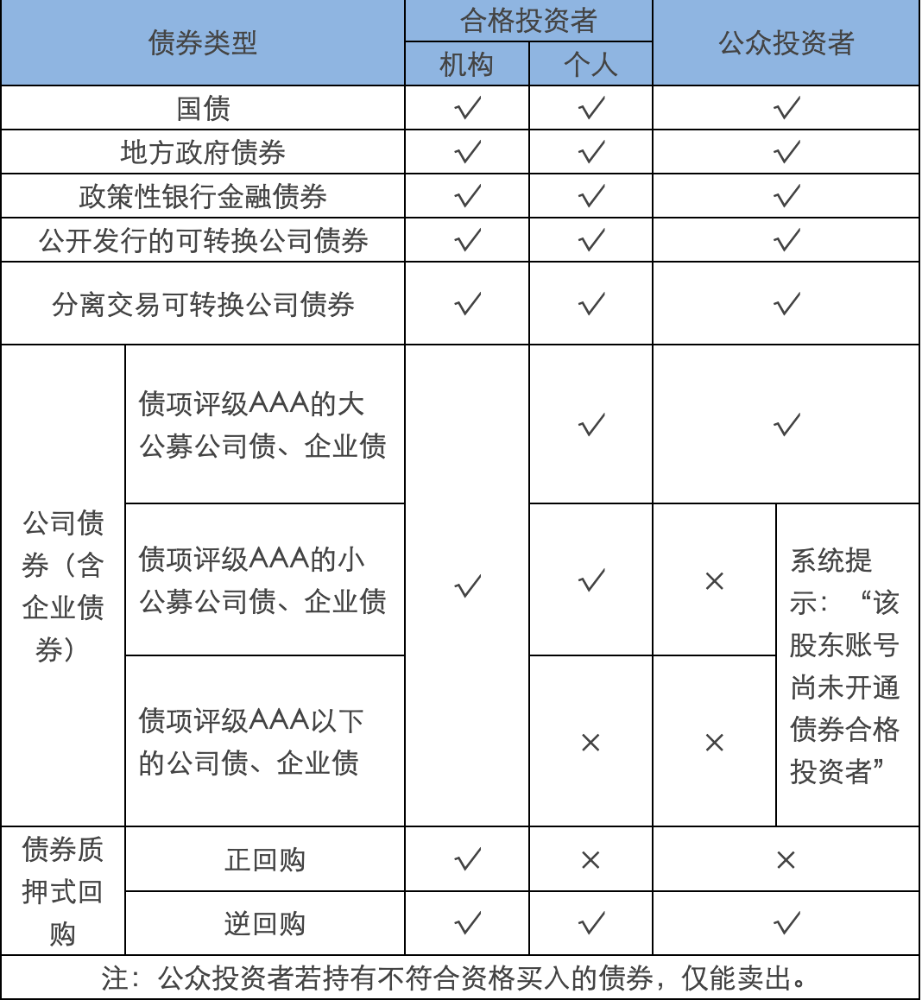
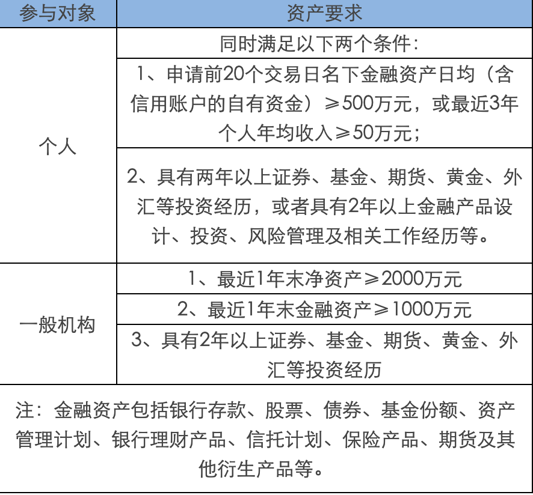

# 债券适当性

**合格投资者开通**

**特殊法人机构**

注：以下3类机构客户为`合格投资者`

（一）经有关金融监管部门批准设立的金融机构，包括证券公司、期货公司、基金管理公司及其子公司、商业银行、保险公司、信托公司、财务公司等；经行业协会备案或者登记的证券公司子公司、期货公司子公司、私募基金管理人。

（二）上述机构面向投资者发行的理财产品，包括但不限于证券公司资产管理产品、基金管理公司及其子公司产品、期货公司资产管理产品、银行理财产品、保险产品、信托产品、经行业协会备案的私募基金。

（三）社会保障基金、企业年金等养老基金，慈善基金等社会公益基金，合格境外机构投资者（QFII）、人民币合格境外机构投资者（RQFII）。
