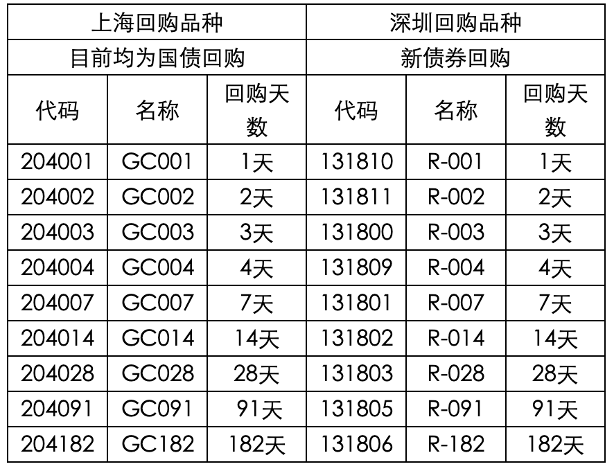

# 债券质押式回购

债券正回购就是投资者抵押出合格的债券，经过一定比例折算后，计算出可以融入的资金，然后通过市场借入资金，并且在约定的时间归还本金和约定的利息的交易。与其对应的，把资金借给正回购方，到期以后获得本金加收益的投资者就是逆回购回购方。作为回购当事人的正、逆回购方是相互对应的，有进行主动交易的正回购方就一定有接受该交易的逆回购方。由此，我们可以简单地说：正回购方就是抵押出债券，取得资金的融入方；而逆回购方就是接受债券质押，借出资金的融出方。

目前债券正回购对投资者要求较高，必须是具有债券市场合格投资者资格的机构客户才能够参与正回购业务，普通投资者无法参与。

逆回购普通投资者都可以参与。个人及机构客户交易债券质押式逆回购需要单独开通逆回购权限。权限开通要求：已在我司开通了沪深A股股东账户，通过临柜或者互联网的方式操作申请，申请后立刻生效可以交易逆回购。

**逆回购交易规则**

实际占款天数：是指当次回购交易的首次交收日（含）至到期交收日（不含）的实际日历天数。即：成交日的下一个交易日（含）至到期日的下一个交易日（不含）之间的实际自然天数。

首次交收日：首次交收日为首次清算日（即购买当日T日）的下一交易日。

到期清算日：到期清算日为首次清算日加上回购期限天数（按自然日）。若到期日为非交易日，则顺延至下一交易日清算。

到期交收日：到期交收日为到期清算日的下一个交易日。

## 案例说明

（1）客户周一购买3天期限的逆回购，资金周四可用，周五可取。首次交收日为周二 ，到期清算日为周四 ，到期交收日为周五，计算收益时，天数为从周二（含）至周五（不含），即为周二、周三、周四3天。

（2）客户周四购买1天期限的逆回购，资金周五可用，下周一可取。首次交收日为周五，到期清算日为周五，到期交收日为下周一，计算收益时，天数为从周五（含）至下周一（不含），即为周五、周六、周日3天。

（3）客户周五购买1天期限的逆回购，资金下周一可用，下周二可取。首次交收日为下周一，到期清算日为下周一，到期交收日为下周二，计算收益时，天数为从下周一（含）至下周二（不含），即为下周一1天。

（4）客户周五购买3天期限的逆回购，资金下周一可用，下周二可取。首次交收日为下周一，到期清算日为下周一，到期交收日为下周二，计算收益时，天数为从下周一（含）至下周二（不含），即为下周一1天。

**现有品种**

**交易费用**

