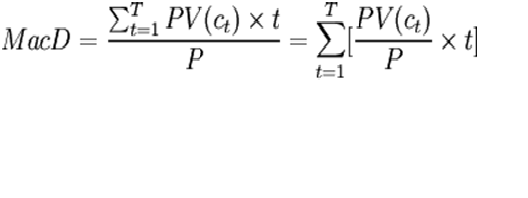

# 什么是债券久期

债券久期是指由于决定债券价格利率风险大小的因素主要包括偿还期和息票利率，因此需要找到某种简单的方法，准确直观地反映出债券价格的利率风险程度。经过长期研究，人们提出“久期”的概念，把所有影响利率风险的因素全部考虑进去。这一概念最早是由经济学家麦考雷于1938年提出的，所以又称麦考雷久期（简记为D）。麦考雷久期是使用加权平均数的形式计算债券的平均到期时间。它是债券在未来产生现金流的时间的加权平均,其权重是各期现金值在债券价格中所占的比重。

**公式**

* M acD是麦考雷久期，
* P是债券当前的市场价格，
* PV（Ct）是债券未来第t期可现金流（利息或资本）的现值，
* T是债券的到期时间。
* t为从当前到t时刻现金流发生的持续时间。
* y为债券的风险程度相适应的收益率。假设未来所有现金流的贴现率都固定为y。
