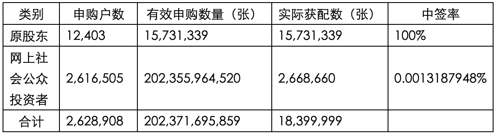

# 可转债发行新规

2017年9月8日开始实施可转债发行的新规后，投资者可以体验到0成本，无条件的顶格申购。这样的条件几乎是人人都可以参与，广大的散户投资者成为最直接的受益对象。

首先了解一下什么是可转债：

“可转换公司债券”简称可转债，是上市公司发行的一种特殊债券，该债券可以根据合同条款，转换成该上市公司对应数量的股份。通常可转债的票面利率较低。可转债既有债券的性质，又有股票的性质。它可以像普通债券一样上市交易，持有到期收取固定利息，这样可以取得稳定收益。一旦投资者把债券转换成股票，即意味着投资者持有的债权变成股权，获得参与股票分红，参与公司决策等权利。

新规发布以来，已经有两支采用信用申购的可转债发行，分别是雨虹转债和林洋转债。并且即将迎来第三支可转债的发行（金禾转债）。在新规下，投资者无需持有股票，也无需持有资金，照样可以顶格申购。

新规下发行的第一支可转债是由北京东方雨虹防水技术股份有限公司（股票代码：002271）发行的雨虹转债（债券代码：128016），发行的总量是18.40 亿元（共计 18,400,000 张），发行日期为 2017 年 9 月 25 日。

其发行结果如下：

1、向原 A 股股东优先配售结果

原股东共优先配售雨虹转债 15,731,339 张，共计 1,573,133,900 元，占本次发行总量的 85.50%。

2、网上向一般社会公众投资者发售结果

本次发行最终确定的网上向社会公众投资者发行的雨虹转债为 266,866,000 元（2,668,660 张），占本次发行总量的 14.50%，网上中签率为`0.0013187948%`。

雨虹转债上市日期是2017年10月20日，上市首日最高价格到达124.1元，也就是说如果投资者中签后在上市首日卖出就可以获得最高24%的收益水平。

发行可转债的对象可以分为原股东配债，和向社会公众发债两种模式，向原股东配债的，拥有优先认购权利。从结果可以看到，雨虹转债原股东配债占总发行量的85.5%。（第二支可转债林洋转债的原股东配债占比也要达到78.47%），也就是说，发行的总额度大部分由股东配售申购，分给普通投资者的比例只有在20%左右，如果想要申购债券的，可以购买该上市公司A股股票，通过配售的方式来购买债券更加有利。

具体申购规则：

1. 向原股东配售

    （1）适用对象：原股东（即在股权登记日日终持有该股票的客户）

    （2）发行日前一日晚，配售权利将会转入客户账户内。客户也可放弃配债的操作权利。

    （3）配售权利的数量，是以客户持有该上市公司的股票数量，按一定的配售比例进行核定的。沪市为10张的整数倍；深市为1张的整数倍。

    （4）股东参与配债申购，一定可以获得对应数量的债券，同时仍可继续参与该债券对社会公众发行部分的申购。

    （5）原股东参与配售时需在其优配额度之内根据优先配售的可转债数量足额缴付资金。

2. 向社会公众发售

    （1）适用对象：任意投资者（含配债的老股东）

    （2）发行日当天通过发债代码申购该债券，中签方式类似新股申购。

    （3）参与发债时，无需缴付申购资金；中签的客户需在T+2日（T日为申购日）日终保证账户有足额的认购资金。

    （4）参与发债时，委托数量需为10张整数倍（可以顶格申购）。

向原股东配售和向社会公众发售在操作的时候分别有自己的申购代码，投资者按照自己参与的方式，通过股票买入菜单输入对应的代码就可以申购可转债。

注意事项：

   1. 如果是社会公众发债的方式参与的，投资者可以顶格申购，也就是按照申购上限数量申报，不用担心要缴款几百万，通常一个账户只会中一个号，且在中签后缴款，中一个号只要1000元。

   2. 对于参与配售的客户，在配售当日需要留足配售额度内的缴款资金；对于参与社会公众发债的客户，申购日可以无资金要求，如果确认自己中签，需在T+2日（T日为申购日）日终保证账户有足额的认购资金。

   3. 投资者连续 12 个月内累计出现 3 次中签但未足额缴款的情形时，自结算参与人最近一次申报其放弃认购的次日起 6 个月（按 180 个自然日计算，含次日）内不得参与网上新股、可转债及可交换债申购。放弃认购的次数按照投资者实际放弃认购的新股、可转债、可交换债的只数合并计算。 投资者一定要关心缴款时间。

   4. 每个证券账户只能申购一次，多次申购的，以第一笔为有效，其他都视为无效。

   5. 投资者需要注意理性投资，切勿盲目申购，为了获得原股东有限配售权，盲目买入上市公司的股票，导致股票套路就得不偿失了。

   6. 注意投资流动性风险，申购到债券以后，还需要等待上市公司公告该债券的上市日期。雨虹转债的上市日期和发行日期中间相隔近一个月时间。

   7. 可转债通常本身利率较低，投资者也要及时了解，债券投资风险，以及相应的转换条款、债券回售条款、提前赎回条款和利率对付条款等。

后续的可转债概念股票：

