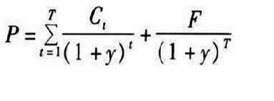

# 市场利率和债券价格关系

市场利率指的是资金市场上实际借贷的利率，根据市场资金供求关系决定，能够真实的反应市场的资金需求情况。如果市场资金供给量高，需求量少，利率就会下降；反之，利率升高。

**债券估值模型**

- P是债券现价
- T是债券距到期日时间
- t是现金流到达时间
- C是每期收益的现金流入
- F是本金
- y是利率

可见债券价格和市场利率成反比，市场利率越小，债券价格越高；市场利率越低，债券价格越高。
