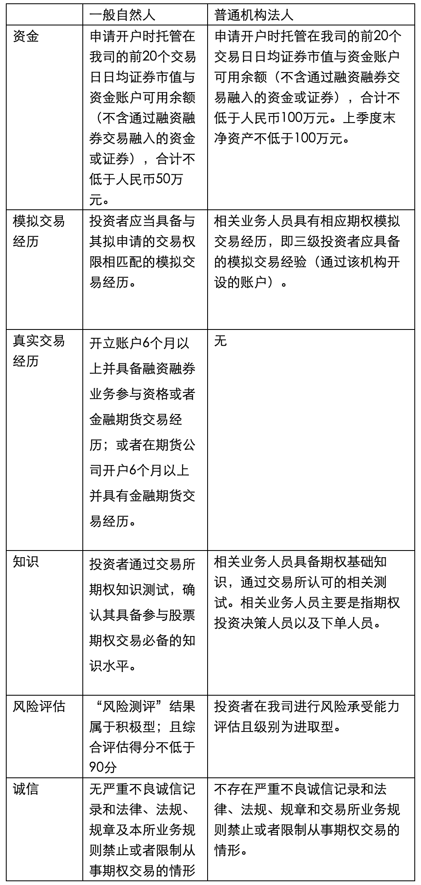

# 个股期权开户条件

除法律、法规、规章以及监管机构另有规定外，下列专业机构投资者参与期权交易，不对其进行综合评估：

（一）商业银行、期权经营机构、保险机构、信托公司、基金管理公司、财务公司、合格境外机构投资者等专业机构及其分支机构；

（二）证券投资基金、社保基金、养老基金、企业年金、信托计划、资产管理计划、银行及保险理财产品，以及由第一项所列专业机构担任管理人的其他基金或者委托投资资产；

（三）监管机构及本所规定的其他专业机构投资者。
