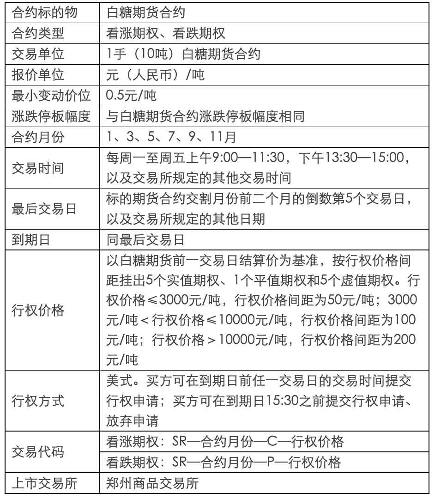

# 商品期货期权-白糖

**白糖期权**

## 交易细则

期权交易实行做市商制度。

期权交易限价指令、市价指令和套利指令的每次最大下单数量与期货有关规定相同，交易所可以根据市场情况进行调整。

期权套利指令须附加指令属性。指令属性包括立即成交剩余指令自动撤销、立即全部成交否则自动撤销等。

期权套利指令包括：

（一）买入跨式套利，是指同时买入相同数量的同一标的物、同到期日、同行权价格的看涨期权和看跌期权；

（二）卖出跨式套利，是指同时卖出相同数量的同一标的物、同到期日、同行权价格的看涨期权和看跌期权；

（三）买入宽跨式套利，是指同时买入相同数量的同一标的物、同到期日、较高行权价格看涨期权和较低行权价格看跌期权；

（四）卖出宽跨式套利，是指同时卖出相同数量的同一标的物、同到期日、较高行权价格看涨期权和较低行权价格看跌期权。

集合竞价期间，交易所不接受套利指令。

期权合约了结方式包括平仓、行权和放弃。

平仓是指客户买入或卖出与其所持期权合约数量相同、方向相反的相同期权合约以了结期权持仓的方式。相同期权是指标的物、类型、月份、到期日和行权价格相同的期权合约。

行权是指买方按照规定行使权利，以行权价格买入或者卖出标的物，或者按照规定的结算价格进行现金差价结算以了结期权持仓的方式。

放弃是指期权合约到期，买方不行使权利以了结期权持仓的方式。
