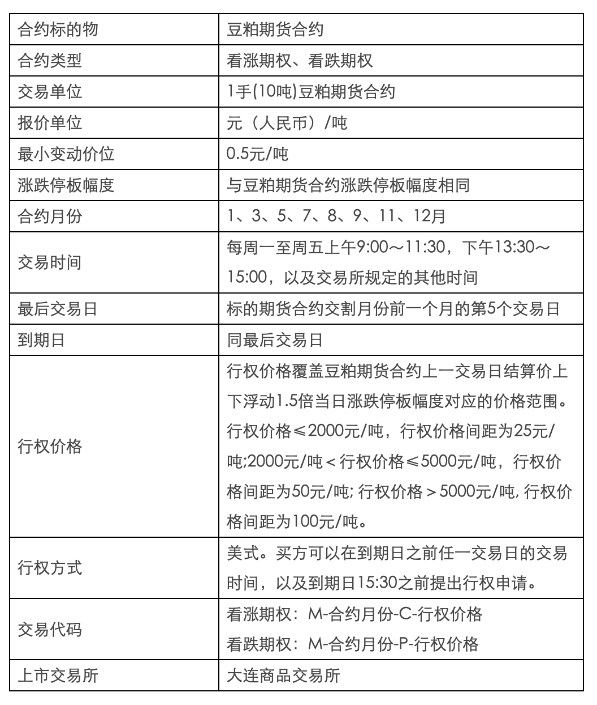

- [商品期货期权——豆粕](#商品期货期权豆粕)
  - [交易细则](#交易细则)
  - [结算细则](#结算细则)
  - [风险控制](#风险控制)

# 商品期货期权——豆粕

## 交易细则

期权合约的主要条款包括：合约标的物、合约类型、交易单位、报价单位、最小变动价位、涨跌停板幅度、合约月份、交易时间、最后交易日、到期日、行权价格、行权方式、交易代码和上市交易所。

期权合约类型包括看涨期权和看跌期权。

看涨期权是指买方有权在将来某一时间以特定价格买入标的期货合约，而卖方需要履行相应义务的期权合约。

看跌期权是指买方有权在将来某一时间以特定价格卖出标的期货合约，而卖方需要履行相应义务的期权合约。

交易所对期权合约提供限价指令和限价止损（盈）等指令。限价指令可以附加立即全部成交否则自动撤销和立即成交剩余指令自动撤销两种指令属性。

期权合约交易指令每次最大下单数量与标的期货合约交易指令每次最大下单数量相同。

交易所可以根据市场情况对期权合约交易指令的种类和每次最大下单数量进行调整并公布。

期权合约了结方式包括平仓、行权和放弃。

平仓是指买入或者卖出与所持期权合约的数量、标的物、月份、到期日、类型和行权价格相同但交易方向相反的期权合约，了结期权合约的方式。

行权是指期权买方按照规定行使权利，以行权价格买入或者卖出标的期货合约，了结期权合约的方式。

放弃是指期权合约到期，买方不行使权利以了结期权合约的方式。

期权买方可以申请对其同一交易编码下行权后的双向期货持仓进行对冲平仓，对冲数量不超过行权获得的期货持仓量。对冲结果从当日期货持仓量中扣除，并计入成交量。

期权卖方可以申请对其同一交易编码下履约后的双向期货持仓进行对冲平仓，对冲数量不超过履约获得的期货持仓量。对冲结果从当日期货持仓量中扣除，并计入成交量。

在交易所规定时间内，期权买方可以提出行权申请。

期权卖方有履约义务。履约是指当期权买方提出行权时，期权卖方有义务按合约规定的行权价格买入或者卖出一定数量的标的期货合约。

每日交易闭市后，交易所按照随机均匀抽取原则进行行权配对。

看涨期权行权与履约后，期权买方按行权价格获得期货买持仓，卖方按同一行权价格获得期货卖持仓。

看跌期权行权与履约后，期权买方按行权价格获得期货卖持仓，卖方按同一行权价格获得期货买持仓。

到期日闭市后，交易所进行如下处理：

（一）行权价格小于当日标的期货合约结算价的看涨期权持仓自动申请行权；

（二）行权价格大于当日标的期货合约结算价的看跌期权持仓自动申请行权。

期权买方也可以取消自动申请行权。

每日交易闭市后，交易所根据闭市时的期权买方持仓及其所在会员的结算准备金余额，以申请时间优先的原则按照以下步骤确定期权能否行权：

（一）期权行权建立的期货合约持仓与原期货合约持仓之和不得超过该期货合约的持仓限额，否则实行部分行权或者不予行权；

（二）期权行权后期权买方会员的结算准备金余额不得低于零，否则实行部分行权或者不予行权，具体要求如下：

1.行权价格小于（大于）标的期货合约当日结算价的看涨（跌）期权以及行权价格等于标的期货合约当日结算价的期权行权时，结算准备金余额应当满足相应期货合约上一交易日结算时的交易保证金要求；

2.行权价格大于（小于）标的期货合约当日结算价的看涨（跌）期权行权时，结算准备金余额应当满足相应期货合约上一交易日结算时的交易保证金要求，并能弥补虚值额。虚值额的计算方法如下：

看涨期权的虚值额=M ax（期权合约行权价格-标的期货合约结算价，0）×标的期货合约交易单位；

看跌期权的虚值额=M ax(标的期货合约结算价-期权合约行权价格，0）×标的期货合约交易单位。

## 结算细则

期权交易的买方支付权利金，不交纳交易保证金；期权交易的卖方收取权利金，交纳交易保证金。

期权买方（卖方）开仓时，按照开仓成交价支付（收取）权利金；期权买方（卖方）平仓时，按照平仓成交价收取（支付）权利金。

期权卖方开仓时，交易所按照上一交易日结算时该期权合约保证金收取期权卖方交易保证金；期权卖方平仓时，交易所释放期权卖方所平期权合约的交易保证金。

每日结算时，交易所按期权、期货合约当日结算价计收期权卖方的交易保证金，根据成交量和行权量（履约量）计收买卖双方的交易手续费和行权（履约）手续费，并对应收应付的款项实行净额一次划转，相应增加或减少会员的结算准备金。

对于行权或放弃的买卖双方，交易所于结算时减少各自相应的期权合约持仓，同时释放期权卖方交易保证金。

由期权行权转化的期货持仓不参与当日期货结算价计算。

## 风险控制

交易所风险管理实行保证金制度、涨跌停板制度、限仓制度、交易限额制度、大户报告制度、强行平仓制度和风险警示制度。

期权交易实行保证金制度。期权卖方交易保证金的收取标准为下列两者中较大者：

（一）期权合约结算价×标的期货合约交易单位+标的期货合约交易保证金－（1/2）×期权虚值额；

（二）期权合约结算价×标的期货合约交易单位+（1/2）×标的期货合约交易保证金。

期权交易实行涨跌停板制度。停板价格计算公式如下：

（一）涨停板价格 = 期权合约上一交易日结算价+标的期货合约涨跌停板幅度；

（二）跌停板价格 = M ax（期权合约上一交易日结算价-标的期货合约涨跌停板幅度，期权合约最小变动价位）。

涨（跌）停板单边无连续报价是指某一 期权合约在某一交易日收盘前5分钟内出现只有停板价位的买入(卖出)申报、没有停板价位的卖出(买入)申报，或者一有卖出(买入)申报就成交、但未打开停板价位的情况。

如果某期权合约上一交易日结算价小于等于当日涨跌停板幅度，且当日收盘前5分钟内出现只有最低报价的卖出申报、没有最低报价的买入申报，或者一有买入申报就成交、但未打开最低报价的情况，交易所不将其按照跌停板单边无连续报价处理。

期权交易实行限仓制度。期权限仓是指交易所规定非期货公司会员或者客户可以持有的，按单边计算的某月份期权合约投机持仓的最大数量。

期权合约与期货合约不合并限仓。期权合约在其交易过程中的不同时间阶段，分别适用不同的持仓限额。时间阶段的划分与标的期货合约相同。

当会员、客户出现下列情形之一时，交易所有权对其持仓进行强行平仓：

（一）会员结算准备金余额小于零，并未能在规定时限内补足的；

（二）非期货公司会员或客户持仓量超出限仓规定的；

（三）因违规受到交易所强行平仓处罚的；

（四）根据交易所的紧急措施应予强行平仓的；

（五）其他应予强行平仓的。

强行平仓前先由会员自己执行，除交易所特别规定外，对开设夜盘交易的品种，其时限为夜盘交易小节和第一节交易时间内；对未开设夜盘交易的品种，其时限为第一节交易时间内。若时限内会员未执行完毕，则由交易所强制执行。因结算准备金小于零而被要求强行平仓的，在保证金补足至最低结算准备金余额前，禁止相关会员的开仓交易。
