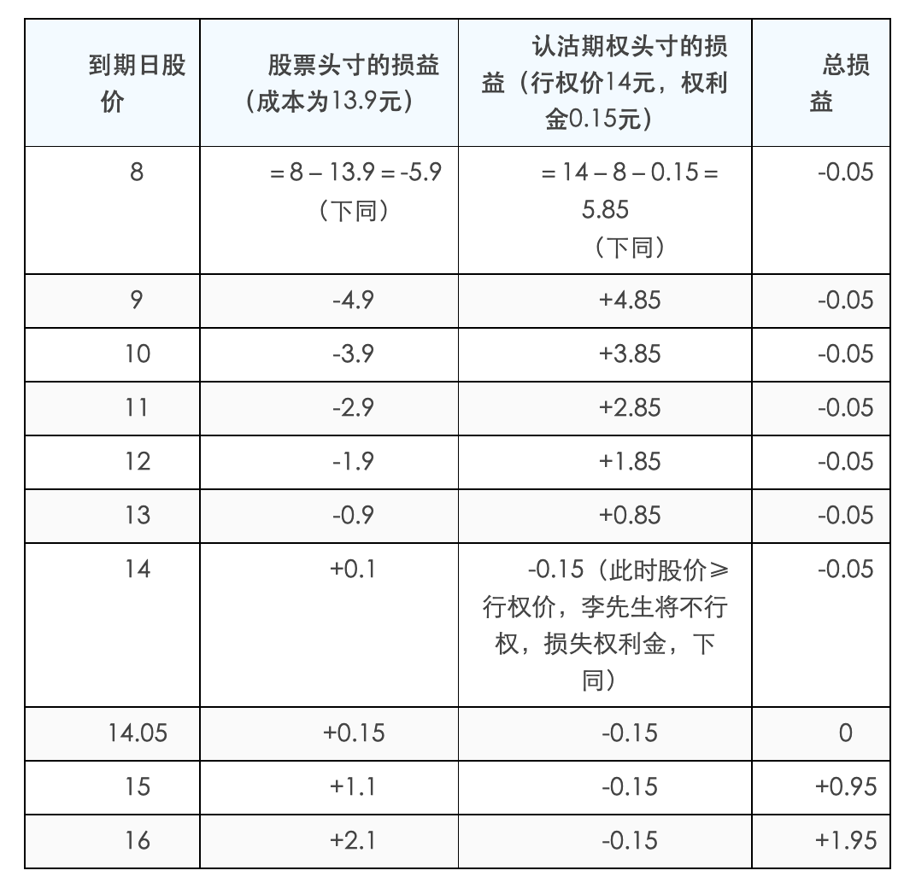

# 期权策略篇之“保险策略（二）”

沿用上一篇的例子，李先生以每股13.90元的价格买入5000股X股票，同时买入1月到期、行权价为14元的认沽期权，权利金为0.15元/股，合约单位为5000。

到期日当X股票出现不同价格时，李先生的股票和期权头寸各自损益将出现不同情形（以下损益为每股损益，单位：元）

根据上述表格，我们可以得到策略的损益图如下图所示（为了简单起见，分析和计算均忽略了交易成本和分红等情况）。

<!--差一张GIF图片-->

李先生通过保护性买入认沽策略，每股最大的亏损为0.05元，最大的盈利理论上是无限的，若不考虑交易成本，则该策略的盈亏平衡点为14.05元/股（即：13.90元+0.15元）。如果股价高于14.05元，李先生的组合头寸就开始出现盈利，股价涨得越多，盈利也越多；如果股价低于14.05元，李先生的这一策略就开始出现亏损，但是并不是“跌的越多、损失越多”，而是在跌破14元行权价以后，无论股价如何下跌，每股亏损已锁定在0.05元。

因此，保护性买入认沽策略的盈亏平衡点和最大亏损分别为：

盈亏平衡点=购买股票时的价格+认沽期权的权利金；

投资者的最大亏损额=认沽期权的行权价－（购买股票时的价格+认沽期权的权利金）。

投资者或许会问，在实战操作中，应该在哪些情景下使用保护性买入认沽策略呢？接下来我们将列举常用的几种使用场景。

场景一：王先生持有10000份180ETF，当初的买入价格为1.910元/份。由于王先生同时参与了融资融券业务，在融资业务上已经把180ETF作为了可充抵保证金证券，因此该基金份额无法卖出。王先生担心在这段质押期内，180ETF的价格会出现下跌。

此时，他可以使用保护性买入认沽策略。

假设目前市场上有一份行权价为1.9元/份的近月认沽期权“180ETF沽4月1900”，权利金大约为0.037元/份，合约单位为10000。

那么王先生可以以370元的成本买入一张“180ETF沽4月1900”合约，其中370元等于每股权利金0.037元乘以合约单位10000。

根据公式，我们便可推知王先生的最大亏损＝[行权价格（即1.900元）－ETF买入成本（即1.910元）－认沽期权权利金（即0.037元）]*10000＝－470元，表明最大亏损额为470元；

盈亏平衡点＝ETF买入成本（即1.910元）+认沽期权权利金（即0.037元）＝1.947元。

由此，王先生就不必担心180ETF在质押期内可能出现的下跌。同时，如果180ETF价格上涨，王先生仍然可以获益。

场景二：沈先生长期看好X股票股价，想买入1000股，但他担心短期受到大盘的拖累或黑天鹅事件的影响导致股价下跌。

此时他也可以使用保护性买入认沽策略。

假设目前市场上X股票为每股39元，有一份行权价为37.50元/股的近月认沽期权“X股票沽4月3750”，权利金大约为0.59元/股，合约单位为1000。

那么沈先生的操作是：以39000元的成本买入1000股股票，同时以590元的成本买入一张“X股票沽4月3750”合约，其中590元等于每股权利金0.59元乘以合约单位1000。

根据公式，我们可以推知沈先生的最大亏损额为2090元，盈亏平衡点为39.59元。同样，沈先生也无需担心X股票短期可能出现的下跌。

场景三：袁先生持有5000股Y股票（买入价为每股14元）,他得知该公司将在一个月内分红。为了获得此次股息和红利，袁先生打算在今后一个月内继续持有该股票，可是他又不想因股价下跌而蒙受市值上的损失。

假设目前市场上有一份行权价为14元/股的近月认沽期权“Y股票沽4月1400”，权利金大约为0.35元/股，合约单位为5000。

那么袁先生可以以1750元的成本买入一张该合约，此时袁先生的最大亏损额为1750元，盈亏平衡点为14.35元。

有了这样的操作，袁先生可以安心地持有股票以获得股息和红利。在期权到期日，如果股价低于14元，而且不管跌得多低，袁先生都可以将股票以14元的固定价格（即期权的行权价）卖给期权的义务方。相反，如果到期日股价高于14元，那么袁先生在得到股息和红利的同时，还可以获得股票上涨的收益。为获得这样的“保障”，袁先生付出了1750元的“保费”。

场景四：许先生以1.480元/份的价格买入了10000份50ETF，目前该ETF已经涨到了1.550元/份。这时，许先生担心如果卖出后价格继续上涨，他会为此而感到后悔；如果不卖出，又担心价格回落。他希望既能锁定现有收益，又能保留潜在收益。

面对许先生这一投资需求，保护性买入认沽策略可能比较适合。

假设目前市场上有一份行权价为1.550元/份的近月认沽期权“50ETF沽4月1550”，权利金大约为0.02元/份，合约单位为10000。

那么许先生以200元的成本买入一张合约。如果50ETF跌破1.550元，不管跌的多低，许先生都可以以每份1.550元的价格卖出手中的50ETF，扣除买入ETF的成本以及期权权利金的成本，我们便可推知他的收益至少为500元，即（1.550-1.480-0.02）*10000。如果50ETF继续上涨，许先生可以仍然享受ETF价格上涨的收益。

总结而言，保护性认沽策略可以为投资者在短期难以出售手中股票，或犹豫在上涨时是否卖出持有股票的情况下，提供一种既避免下跌损失、又保留上涨收益的选择。当然，这一策略的使用还需要注意几个问题，我们将在下一篇中介绍。
