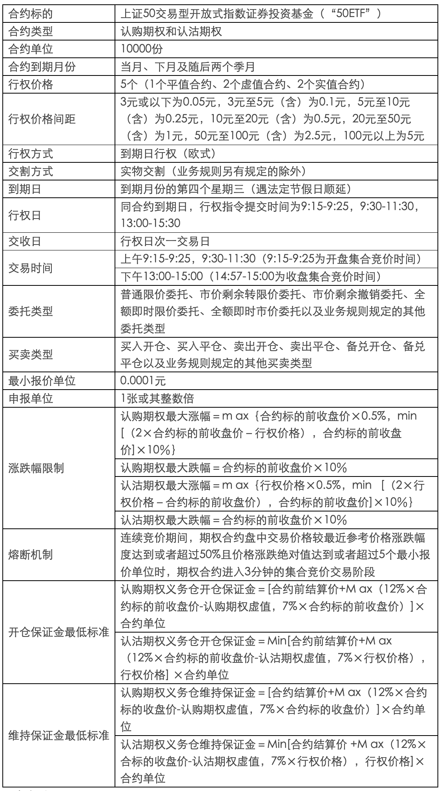

# 个股期权交易规则

**买卖类型**

- **买入开仓**：买入认购或者认沽期权，获得权力仓。

- **买入平仓**：已经有义务仓，买入期权，了解对应数量的义务仓位。

- **卖出开仓**：卖出认购或认沽期权，形成义务仓。

- **卖出平仓**：已经有权利仓，卖出期权，了解对应数量的权利仓。

- **备兑开仓**：已经持有有标的证券的情况下，卖出对应数量的认购期权，形成义务仓。

- **备兑平仓**：有备兑义务仓的情况下，买入期权，了解对应数量的义务仓。

**股票期权交易费用**

除事先需要缴纳足额保证金外，交易时需要缴纳佣金、结算费、过户费及经手费。

- 【结算费】
  - 【交易的结算费】：合约标的为股票的，每张0.45元；合约标的为ETF的，每张0.3元。交易双方都要收取。
  
  - 【行权的结算费】：合约标的为股票的，每张0.9元；合约标的为ETF的，每张0.6元，向行权方收取。

- 【过户费】-合约标的为股票的，按股票面值0.5‰向过入方收取行权过户费。合约标的为ETF的暂不收取过户费。

- 【经手费】-合约标的为股票的，每张3元；合约标的为交易所交易基金的，每张2元。股票期权试点初期，对上证50ETF期权合约进行卖出开仓的，暂免收取卖出开仓交易的相应交易经手费。

**个股期权强平**

当结算参与人、投资者出现下列情形之一时，登记公司、交易所有权对其相关持仓进行强行平仓：

1. 结算参与人结算准备金余额小于零，且未能在规定时间内（次一交易日上午11：30前）补足；
2. 备兑证券数量不足，且未能在规定时间内（除权除息日次一交易日11：30前）补足并锁定足额数量标的证券或自行平仓；
3. 持仓量超过限仓规定，且未能在规定时间内自行平仓；
4. 因违规、违约被交易所和登记公司要求强行平仓；
5. 根据交易所的紧急措施应予强行平仓；
6. 应予强行平仓的其他情形。
