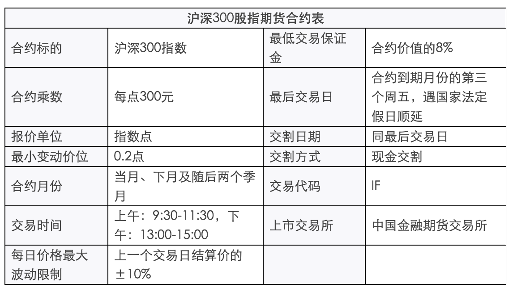

- [股指期货合约及规则](#股指期货合约及规则)
  - [交易细则](#交易细则)
  - [结算细则](#结算细则)

# 股指期货合约及规则

## 交易细则

股指期货合约内容主要条款包括合约标的、合约乘数、报价单位、最小变动价位、合约月份、交易时间、每日价格最大 波动限制、最低交易保证金、最后交易日、交割日期、交割方式、交易代码、上市交易所等。

沪深300股指期货合约的合约乘数为每点人民币300元。股指期货合约价值为股指期货指数点乘以合约乘数。

沪深300股指期货合约的最小变动价位为0.2指数点，合约交易报价指数点为0.2点的整数倍。

沪深300股指期货合约的合约月份为当月、下月及随后两个季月。季月是指3月、6月、9月、12月。

沪深300股指期货合约的每日价格最大 波动限制是指其每日价格涨跌停板幅度，为上一交易日结算价的±10%。

沪深300股指期货合约到期时采用现金交割方式。

交易指令分为市价指令、限价指令及交易所规定的其他指令。

市价指令是指不限定价格的、按照当时市场上可执行的最优报价成交的指令。市价指令的未成交部分自动撤销。

限价指令是指按照限定价格或者更优价格成交的指令。限价指令在买入时，必须在其限价或者限价以下的价格成交；在卖出时，必须在其限价或者限价以上的价格成交。限价指令当日有效，未成交部分可以撤销。

交易指令每次最小下单数量为1手，市价指令每次最大下单数量为50手，限价指令每次最大下单数量为100手。

期货连续竞价交易按照价格优先、时间优先的原则撮合成交。以涨跌停板价格申报的指令，按照平仓优先、时间优先的原则撮合成交。

开盘集合竞价中的未成交指令自动参与连续竞价交易。

限价指令连续竞价交易时，交易所系统将买卖申报指令以价格优先、时间优先的原则进行排序, 当买入价大于、等于卖出价则自动撮合成交。撮合成交价等于买入价(bp)、卖出价(sp)和前一成交价(cp)三者中居中的一个价格。即：

当 bp≥sp≥cp,则：最新成交价=sp

bp≥cp≥sp,　最新成交价=cp

cp≥bp≥sp,　最新成交价=bp

## 结算细则

无负债结算制度。

当日收市后，交易所按照当日结算价对结算会员所有合约的盈亏、交易保证金及手续费、税金等费用进行清算，对应收应付的款项实行净额一次划转，相应增加或者减少结算准备金。

结算会员在交易所结算完成后，按照前款原则对客户、交易会员进行结算；交易会员按照前款原则对客户进行结算。

当日结算价

当日结算价是指某一 期货合约最后一小时成交价格按照成交量的加权平均 价。计算结果保留至小数点后一位。

最后一小时因系统故障等原因导致交易中断的，扣除中断时间后向前取满一小时视为最后一小时。

合约最后一小时无成交的，以前一小时成交价格按照成交量的加权平均 价作为当日结算价。该时段仍无成交的，则再往前推一小时。以此类推。合约当日最后一笔成交距开盘时间不足一小时的，则取全天成交量的加权平均 价作为当日结算价。

合约当日无成交的，当日结算价计算公式为：当日结算价=该合约上一交易日结算价+基准合约当日结算价－基准合约上一交易日结算价，其中，基准合约为当日有成交的离交割月最近的合约。合约为新上市合约的，取其挂盘基准价为上一交易日结算价。基准合约为当日交割合约的，取其交割结算价为基准合约当日结算价。根据本公式计算出的当日结算价超出合约涨跌停板价格的，取涨跌停板价格作为当日结算价。

采用上述方法仍无法确定当日结算价或者计算出的结算价明显不合理的，交易所有权决定当日结算价。

当日盈亏=∑[（卖出成交价-当日结算价）×卖出量×合约乘数]+∑[（当日结算价-买入成交价）×买入量×合约乘数]+（上一交易日结算价-当日结算价）×（上一交易日卖出持仓量-上一交易日买入持仓量）×合约乘数

当日盈亏在当日结算时进行划转，盈利划入结算会员结算准备金，亏损从结算会员结算准备金中扣划。

当日结算时，结算会员账户中的交易保证金超过上一交易日结算时的交易保证金部分从结算准备金中扣划，交易保证金低于上一交易日结算时的交易保证金部分划入结算准备金。

手续费、税金等各项费用从结算准备金中扣划。

当日结算准备金余额=上一交易日结算准备金余额+上一交易日交易保证金－当日交易保证金+当日盈亏+入金－出金－手续费等。

结算完毕后，结算会员的结算准备金余额低于最低余额标准时，该结算结果即视为交易所向结算会员发出的追加保证金通知，两者的差额即为追加保证金金额。
